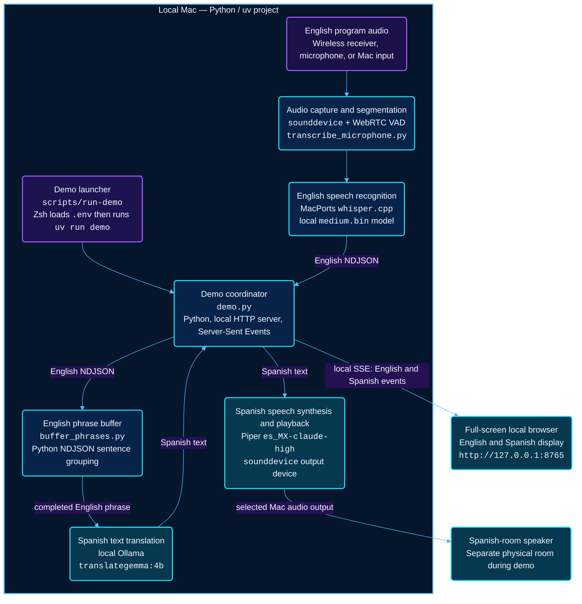

# Local Live Audio Translation

An experimental, local-first prototype for turning English program audio into intelligible Spanish spoken audio for live-event broadcasting.

## First goal

Prove a simple recorded-audio flow before connecting to OBS, Zoom, network audio, or the existing AV system:

```text
Recorded English speech
  -> English speech recognition
  -> English-to-Spanish text translation
  -> Spanish text-to-speech
  -> Spanish audio file
```

The initial work deliberately evaluates general translation quality only. LDS-specific terminology, names, scripture references, glossaries, corpus retrieval, and model fine-tuning are later phases.

## Current local demo architecture

The working prototype is a self-contained Mac demo. After the Python packages
and model files are downloaded, every stage below runs locally; the browser
connects only to `127.0.0.1` and no speech or text is sent to the internet.



| Component | Technology | What it does |
| --- | --- | --- |
| Demo launcher | Zsh, `.env`, `uv` | Starts the demo from the project root and forwards any command-line switches to `demo`. |
| Demo coordinator | Python `demo.py`, built-in `ThreadingHTTPServer`, Server-Sent Events | Starts the live workers, sends English and Spanish events to the display, and coordinates translation and speech. It binds the display to the local Mac only. |
| Audio capture and pause detection | `sounddevice`, WebRTC VAD | Receives the English input continuously and identifies phrase boundaries using natural pauses. |
| English ASR | MacPorts `whisper.cpp`, local Whisper `medium.bin` | Converts each completed English audio phrase into text. |
| Phrase buffer | Python `buffer_phrases.py`, NDJSON | Holds unfinished ASR text briefly so the translator receives more complete sentences and fewer mid-sentence fragments. |
| Text translation | Local Ollama, `translategemma:4b` | Translates completed English phrases into Spanish without calling a cloud service. |
| Spanish speech | Piper `es_MX-claude-high`, `sounddevice` | Generates Mexican-Spanish speech and plays it sequentially through the selected Mac audio output. |
| Bilingual display | Local browser, HTML/CSS/JavaScript, Server-Sent Events | Shows readable recent English and Spanish phrases in a full-screen two-column view for a non-technical audience. |

## Principles

- Prefer local processing and models that can later run on Linux with an NVIDIA GPU.
- Favor translation accuracy and comfortable listening over the lowest possible latency.
- Keep the translation appliance narrowly scoped: audio in, Spanish audio out.
- Test competing approaches with the same recorded English material and native Spanish-speaker feedback.

## Development environment

This project uses [uv](https://docs.astral.sh/uv/) to manage Python and the virtual environment.

```sh
source .env
uv sync
uv run python --version
```

The `.env` file keeps uv's cache inside this project. Shells do not load `.env`
files automatically, so source it before using `uv` in a new terminal session.

## Whisper transcription experiment

The first executable component transcribes one recorded audio file using the
locally installed Whisper CLI and its `medium` model:

```sh
source .env
uv sync
uv run transcribe-whisper
```

That command uses the bundled 25-second sample by default. Supply a path to
transcribe a recording of your own:

```sh
uv run transcribe-whisper path/to/english-audio.wav
```

A public short sample is included for the first run:

```sh
source .env
uv run transcribe-whisper src/resources/voxtral-winning-call-8s.mp3
```

For a longer, approximately 25-second test:

```sh
source .env
uv run transcribe-whisper src/resources/voxtral-winning-call.mp3
```

The command prints only the transcript to standard output; status and errors
are written to standard error. It uses the local MacPorts model at
`/opt/local/share/whisper/models/medium.bin` by default. Set
`WHISPER_MODEL_PATH` in `.env` to use another local Whisper model.

The wrapper also supplies MacPorts' `/opt/local/lib` path when it starts
Whisper, working around a runtime-library path omission that can reappear when
the MacPorts Whisper variant is changed.

The short sample is an 8-second excerpt of the public `winning_call.mp3` file
used in Mistral's Voxtral documentation. The complete 25-second source clip is
also included as `src/resources/voxtral-winning-call.mp3`.

## Live microphone transcription

Start the local microphone process with:

```sh
source .env
uv sync
uv run transcribe-microphone
```

It captures the default microphone continuously, then sends overlapping windows
to Whisper: a 5-second window begins every 4 seconds. The one-second overlap
helps preserve words that cross a window boundary, while capture continues as
Whisper processes earlier audio. This is the current Medium Whisper baseline;
`.env` selects the locally installed `medium.bin` model. Stop it with Ctrl-C.
The expected delay is about one window plus Whisper processing time.

On first use, macOS may ask for microphone access. Grant access to the terminal
or IDE that launches the command in **System Settings → Privacy & Security →
Microphone**. For a short permission and hardware test, use:

```sh
uv run transcribe-microphone --duration 6
```

Adjust the overlap experiment with `--window-seconds` and `--stride-seconds`.
For example, 5.5-second windows every 4.5 seconds retain a one-second overlap:

```sh
uv run transcribe-microphone --window-seconds 5.5 --stride-seconds 4.5
```

If Whisper cannot keep up, the command reports a backlog warning and discards
older pending windows to remain close to live output.

### Pause-based VAD experiment

The fixed 5-second/every-4-seconds mode remains the baseline. To test local
pause-based phrase boundaries instead, add `--segmentation vad`:

```sh
uv run transcribe-microphone --segmentation vad --output-format ndjson | uv run buffer-phrases | uv run translate-stream
```

VAD keeps capture continuous, waits for approximately 0.7 seconds of silence
after speech, then sends the phrase to Whisper. It retains 0.3 seconds of
pre-roll and forces a split after 10 seconds if someone speaks without pausing.
Tune these with `--vad-silence-seconds`, `--vad-pre-roll-seconds`,
`--vad-min-phrase-seconds`, `--vad-max-phrase-seconds`, and
`--vad-aggressiveness 0` through `3`. Natural pauses improve sentence context
but add the silence threshold to live delay; omit `--segmentation vad` to return
to the fixed-window baseline.

#### Live transcription switch reference

| Switch | Default | Purpose |
| --- | --- | --- |
| `--segmentation fixed` | `fixed` | Use fixed overlapping Whisper windows. |
| `--segmentation vad` | — | Use local pause-based phrase boundaries. |
| `--window-seconds 5` | `5` | Fixed-window duration; applies in `fixed` mode. |
| `--stride-seconds 4` | `4` | Time between fixed-window starts; use a smaller value than the window for overlap. |
| `--vad-silence-seconds 0.45` | `0.7` | Silence required to finish a VAD phrase; lower values reduce delay but can split natural pauses. |
| `--vad-pre-roll-seconds 0.3` | `0.3` | Audio retained immediately before VAD detects speech. |
| `--vad-min-phrase-seconds 0.7` | `0.7` | Shortest detected phrase sent to Whisper. |
| `--vad-max-phrase-seconds 10` | `10` | Forced split for continuous speech without a pause. |
| `--vad-aggressiveness 0`–`3` | `2` | VAD sensitivity; begin with the default unless it misses quiet speech or reacts to noise. |
| `--output-format ndjson` | `text` | Send machine-readable finalized English events to the translation pipeline. |
| `--duration 6` | unlimited | Stop automatically after a short microphone test. |

For the current preferred translation experiment, use Medium Whisper with VAD
and a 0.45-second phrase-end pause:

```sh
uv run transcribe-microphone --segmentation vad --vad-silence-seconds 0.45 --output-format ndjson | uv run buffer-phrases | uv run translate-stream
```

## Streaming text translation

`translate-stream` is the next independent stage: it reads one finalized
English JSON event per line from standard input and writes the corresponding
Spanish JSON event to standard output. It uses the locally running Ollama
service and its installed `translategemma:4b` model; this project does not open
another server or port.

Start Ollama if it is not already running, then test the worker with the
narration-based fixture:

```sh
source .env
uv sync
uv run translate-stream < src/resources/translation-test-input.ndjson
```

Input events require a non-empty `text` field. `id`, `start_ms`, and `end_ms`
are optional and are retained in successful output. For example:

```json
{"id":"segment-1","text":"Good morning.","start_ms":0,"end_ms":1200}
```

Standard output contains only JSON event lines, making it safe to pipe into a
future TTS process. Status and errors are written to standard error. A malformed
input line is reported and skipped; a local Ollama/model failure produces a JSON
error event (retaining the input identifier and timing) so later input can keep
flowing.

## Local Piper Spanish speech

`speak-stream` reads translated Spanish JSON events and plays them in order
through the default local audio output device. It keeps Piper loaded for the
whole process, avoiding per-phrase model startup delay.

First download the Mexican-Spanish voice if it is not already in `models/piper`:

```sh
uv run python -m piper.download_voices --download-dir models/piper es_MX-claude-high
```

Test one Spanish phrase with local speakers or, preferably, headphones:

```sh
printf '%s\n' '{"id":"test-1","text":"Buenos días. Estamos agradecidos de estar con ustedes."}' | uv run speak-stream
```

Run the complete local Babel-fish experiment with headphones to prevent the
Spanish output being captured again by the microphone:

```sh
uv run transcribe-microphone --segmentation vad --vad-silence-seconds 0.45 --output-format ndjson | uv run buffer-phrases | uv run translate-stream | uv run speak-stream
```

Use `--model path/to/voice.onnx` to choose another local Piper voice, or
`--output-device NAME_OR_INDEX` to select a specific sounddevice output. This
stage plays audio locally only; Zoom and virtual microphone routing are later
work.

## Local browser demo

`demo` is an optional, audience-friendly view of the existing local pipeline.
It leaves the individual CLI commands above unchanged, but starts the
microphone, phrase buffer, local TranslateGemma, and Piper stages together. A
browser on the same Mac shows completed English transcripts on the left and
Spanish translations on the right; Spanish is also spoken through the selected
local audio output.

```sh
source .env
uv sync
uv run demo --output-device "NAME_OR_INDEX"
```

For convenience, the project includes a launcher that loads `.env` and can be
started from any working directory:

```sh
./scripts/run-demo
```

Every option is passed directly to `demo`, so it can also select an output
device or tune a component without editing the script:

```sh
./scripts/run-demo --output-device "USB Audio Device"
./scripts/run-demo --vad-silence-seconds 0.35 --no-open-browser
./scripts/run-demo --translation-model translategemma:4b
```

The command opens `http://127.0.0.1:8765` by default. Make that browser window
full screen for the presentation. If the browser should not open automatically,
use `--no-open-browser`; use `--port` to choose another local port.

The demo defaults to the current VAD experiment settings: `--segmentation vad`
and `--vad-silence-seconds 0.45`. It supports the same fixed-window/VAD tuning
options as `transcribe-microphone`, plus `--translation-model`, `--piper-model`,
and `--output-device`.

The display server binds only to `127.0.0.1`, and all models run locally. Once
dependencies and models are installed, the demo works without internet access.
For a real-room test, route English input wirelessly into the Mac and select the
separate-room Spanish speaker as `--output-device`; this avoids the Spanish
audio feeding back into the input microphone. Press Ctrl-C in the launching
terminal to stop all demo processes. If Piper is currently speaking, the demo
finishes that phrase before returning to the shell; this is intentional so
native audio resources can close safely.

### Editing the demo display

The local browser UI is deliberately plain HTML, CSS, and JavaScript. Edit these
files independently, then reload the demo page in the browser:

- `src/resources/web/index.html` — page structure and labels
- `src/resources/web/demo.css` — layout, colors, typography, and responsive styling
- `src/resources/web/demo.js` — browser event handling and visible transcript history

`demo.py` only serves those fixed local files and provides the live `/events`
stream; it does not require a web framework or a frontend build step.

## Live microphone to Spanish text

To run the two local stages together, use one shell pipeline:

```sh
source .env
uv run transcribe-microphone --output-format ndjson | uv run buffer-phrases | uv run translate-stream
```

This starts three focused processes. The microphone command continuously captures
audio and runs local Whisper. `buffer-phrases` combines window-bound English
text into larger translation units, then `translate-stream` passes those phrases
to local TranslateGemma. The final standard output is Spanish NDJSON, ready for
a future TTS stage. English transcripts, startup messages, and warnings remain
visible on standard error, so they do not corrupt that JSON stream.

Use Ctrl-C to stop the pipeline. The microphone event fields `start_ms` and
`end_ms` identify the approximate source Whisper window, not word-level timing.
Without `--output-format ndjson`, `transcribe-microphone` retains its original
readable-English output.

`buffer-phrases` releases text at sentence punctuation when possible. It holds
an unfinished tail for more ASR context, but flushes it after five seconds by
default so live speech cannot stall. Adjust that limit with `--max-wait-seconds`.
