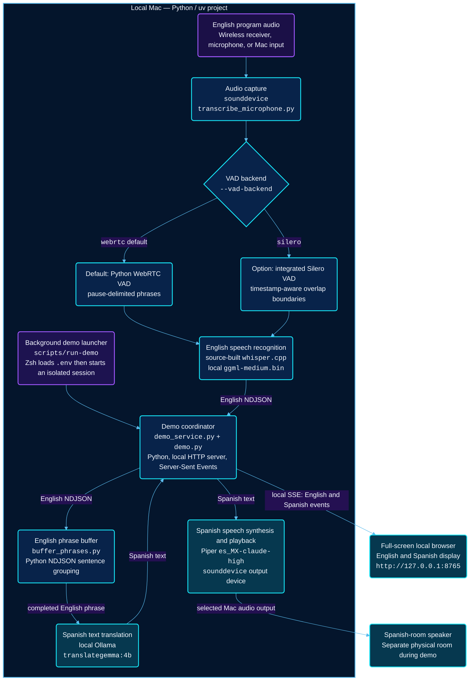
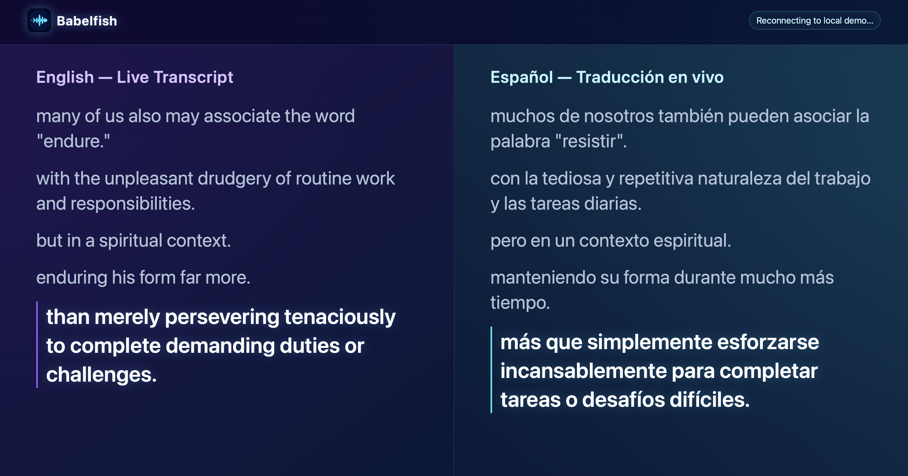

# Local Live Audio Translation

An experimental, local-first prototype for turning English program audio into intelligible Spanish spoken audio for live-event broadcasting.

## First goal

Prove a simple recorded-audio flow before connecting to OBS, Zoom, network audio, or the existing AV system:

```text
Recorded English speech
  -> English speech recognition
  -> English-to-Spanish text translation
  -> Spanish text-to-speech
  -> Spanish audio file
```

The initial work deliberately evaluates general translation quality only. LDS-specific terminology, names, scripture references, glossaries, corpus retrieval, and model fine-tuning are later phases.

## Current local demo architecture

The working prototype is a self-contained Mac demo. After the Python packages
and model files are downloaded, every stage below runs locally; the browser
connects only to `127.0.0.1` and no speech or text is sent to the internet.



| Component | Technology | What it does |
| --- | --- | --- |
| Demo launcher | Zsh, `.env`, `uv`, isolated process group | Starts the demo in the background from any directory and forwards command-line switches to `demo`. `scripts/stop-demo` stops the complete session. |
| Demo coordinator | Python `demo_service.py` and `demo.py`, built-in `ThreadingHTTPServer`, Server-Sent Events | Starts the live workers, sends English and Spanish events to the display, and coordinates translation and speech. It binds the display to the local Mac only. |
| Audio capture and VAD selection | `sounddevice`, `--vad-backend` | Receives English audio continuously and selects Python/WebRTC pause segmentation (default) or stateful local Silero VAD. |
| English ASR | Source-built `whisper.cpp`, local `ggml-medium.bin` | Converts local audio to English. In Silero mode, uses `ggml-silero-v6.2.0.bin` plus full JSON token timing to reconcile overlapping capture windows. |
| Phrase buffer | Python `buffer_phrases.py`, NDJSON | Holds unfinished ASR text briefly so the translator receives more complete sentences and fewer mid-sentence fragments. |
| Text translation | Local Ollama, `translategemma:4b` | Translates completed English phrases into Spanish without calling a cloud service. |
| Spanish speech | Piper `es_MX-claude-high`, `sounddevice` | Generates Mexican-Spanish speech and plays it sequentially through the selected Mac audio output. |
| Bilingual display | Local browser, HTML/CSS/JavaScript, Server-Sent Events | Shows readable recent English and Spanish phrases in a full-screen two-column view for a non-technical audience. |

## Principles

- Prefer local processing and models that can later run on Linux with an NVIDIA GPU.
- Favor translation accuracy and comfortable listening over the lowest possible latency.
- Keep the translation appliance narrowly scoped: audio in, Spanish audio out.
- Test competing approaches with the same recorded English material and native Spanish-speaker feedback.

## Development environment

This project uses [uv](https://docs.astral.sh/uv/) to manage Python and the virtual environment.

```sh
source .env
uv sync
uv run python --version
```

The `.env` file keeps uv's cache inside this project. Shells do not load `.env`
files automatically, so source it before using `uv` in a new terminal session.

## Whisper transcription experiment

The first executable component transcribes one recorded audio file using the
locally installed Whisper CLI and its `medium` model:

```sh
source .env
uv sync
uv run transcribe-whisper
```

That command uses the bundled 25-second sample by default. Supply a path to
transcribe a recording of your own:

```sh
uv run transcribe-whisper path/to/english-audio.wav
```

A public short sample is included for the first run:

```sh
source .env
uv run transcribe-whisper src/resources/voxtral-winning-call-8s.mp3
```

For a longer, approximately 25-second test:

```sh
source .env
uv run transcribe-whisper src/resources/voxtral-winning-call.mp3
```

The command prints only the transcript to standard output; status and errors
are written to standard error. With a source-built `whisper.cpp` executable on
`PATH`, the wrapper discovers the adjacent `models/ggml-medium.bin`. Set
`WHISPER_MODEL_PATH` in `.env` to select another local Whisper model.

The wrapper preserves any existing local dynamic-library fallback path when it
starts Whisper, which keeps the CLI launch self-contained across installations.

The short sample is an 8-second excerpt of the public `winning_call.mp3` file
used in Mistral's Voxtral documentation. The complete 25-second source clip is
also included as `src/resources/voxtral-winning-call.mp3`.

## Live microphone transcription

### Beta version



[Watch the beta-version demo](docs/IMG_1076.MOV)

Start the local microphone process with:

```sh
source .env
uv sync
uv run transcribe-microphone
```

It captures the default microphone continuously, then sends overlapping windows
to Whisper: a 5-second window begins every 4 seconds. The one-second overlap
helps preserve words that cross a window boundary, while capture continues as
Whisper processes earlier audio. This is the current Medium Whisper baseline;
`.env` selects the locally installed `medium.bin` model. Stop it with Ctrl-C.
The expected delay is about one window plus Whisper processing time.

On first use, macOS may ask for microphone access. Grant access to the terminal
or IDE that launches the command in **System Settings → Privacy & Security →
Microphone**. For a short permission and hardware test, use:

```sh
uv run transcribe-microphone --duration 6
```

Adjust the overlap experiment with `--window-seconds` and `--stride-seconds`.
For example, 5.5-second windows every 4.5 seconds retain a one-second overlap:

```sh
uv run transcribe-microphone --window-seconds 5.5 --stride-seconds 4.5
```

For a quiet but valid fixed-gain line input, apply local software gain before
VAD and Whisper. Start at `30 dB` for a raw peak around `0.001`, then reduce it
if loud audio distorts or clips:

```sh
uv run transcribe-microphone --input-gain-db 30
```

The default is `0 dB`; gain is applied to the captured samples only and does
not modify the macOS device setting.

If Whisper cannot keep up, the command reports a backlog warning and discards
older pending windows to remain close to live output.

### Paired video translation evaluation

The paired fixtures in `tests/videos/` contain an English video and a Spanish
translation of the same talk. Each has an embedded subtitle track; the
Spanish subtitles are used as the human-produced baseline. Replay the English
audio through the VAD/Whisper path, translate the resulting events with local
Ollama, and write a comparison report with:

```sh
source .env
uv run python tools/evaluate_video_translation.py \
  tests/videos/2026-04-2030-gary-e-stevenson-360p-eng.mp4 \
  tests/videos/2026-04-2030-gary-e-stevenson-360p-spa.mp4 \
  --output-dir evaluation/video-translation-gary-stevenson
```

The output includes `comparison.md`, the extracted Spanish baseline subtitles,
English ASR events, translated Spanish events, and a manifest. The evaluation
uses the same local Whisper and `translategemma:4b` defaults as the live demo;
make sure Whisper, its model, Ollama, and the model are available first.

### Cross-phrase model context

The live ASR and translation workers retain only short, in-memory context for
one local session. Whisper receives the most recent finalized English ASR
phrase as a decoder prompt; TranslationGemma receives the two most recent
completed English/Spanish phrase pairs as Ollama chat history. The current
audio and current English phrase remain the sources of new output, and no
context text is printed or written to the timing trace.

Use `0` to return to isolated per-phrase processing:

```sh
uv run transcribe-microphone --whisper-context-phrases 0 --output-format ndjson | \
  uv run buffer-phrases | \
  uv run translate-stream --translation-context-phrases 0
```

The default values are `--whisper-context-phrases 1` and
`--translation-context-phrases 2`. Context is reset whenever either worker
starts. Both histories are deliberately bounded (`320` characters for Whisper
and `1,200` total characters for TranslationGemma) to limit latency and stale
topic bias. The browser `demo` command accepts and forwards both options.

### Pause-based VAD experiment

The fixed 5-second/every-4-seconds mode remains the baseline. To test local
pause-based phrase boundaries instead, add `--segmentation vad`:

```sh
uv run transcribe-microphone --segmentation vad --output-format ndjson | uv run buffer-phrases | uv run translate-stream
```

The default VAD backend is local Python/WebRTC VAD. It keeps capture continuous,
waits for approximately 0.7 seconds of silence after speech, then sends the
phrase to Whisper. It retains 0.3 seconds of pre-roll and forces a split after
10 seconds if someone speaks without pausing. Tune it with
`--vad-silence-seconds`, `--vad-pre-roll-seconds`,
`--vad-min-phrase-seconds`, `--vad-max-phrase-seconds`, and
`--vad-aggressiveness 0` through `3`.

To compare Whisper's integrated local Silero VAD, use:

```sh
uv run transcribe-microphone --segmentation vad --vad-backend silero --output-format ndjson | uv run buffer-phrases | uv run translate-stream
```

Silero runs inside `whisper.cpp` for each capture window. The worker uses
Whisper's full JSON token timing offsets to retain only the words that extend
past the previous overlapping window, while retaining boundary context for recognition.
Its phrase timing will differ from the Python/WebRTC pause detector. It requires a recent
`whisper.cpp` CLI exposing `--vad` and `--vad-model`, plus a local GGML Silero
model. The launcher discovers `ggml-silero-v6.2.0.bin` beside a source-built
The stateful implementation uses the locally installed `silero-vad` Python package and detects phrases before sending each completed phrase to Whisper. Whisper continues to use its existing local model and Metal/GPU configuration.

#### Live transcription switch reference

| Switch | Default | Purpose |
| --- | --- | --- |
| `--segmentation fixed` | `fixed` | Use fixed overlapping Whisper windows. |
| `--segmentation vad` | — | Use local pause-based phrase boundaries. |
| `--vad-backend webrtc` | `webrtc` | Use the existing Python/WebRTC pause detector. |
| `--vad-backend silero` | — | Use continuous local Silero phrase detection before Whisper. |
| `--silero-threshold N` | `0.5` | Silero speech confidence threshold. |
| `--silero-min-silence-seconds N` | `0.3` | Silence that ends a Silero phrase. |
| `--silero-speech-pad-seconds N` | `0.1` | Recognition padding around a Silero phrase. |
| `--silero-max-phrase-seconds N` | `10` | Forced maximum Silero phrase duration. |
| `--window-seconds 5` | `5` | Fixed-window duration; also defines the capture window for Silero mode. |
| `--stride-seconds 4` | `4` | Time between fixed-window starts; use a smaller value than the window for context overlap. |
| `--vad-silence-seconds 0.45` | `0.7` | Silence required to finish a VAD phrase; lower values reduce delay but can split natural pauses. |
| `--vad-pre-roll-seconds 0.3` | `0.3` | Audio retained immediately before VAD detects speech. |
| `--vad-min-phrase-seconds 0.7` | `0.7` | Shortest detected phrase sent to Whisper. |
| `--vad-max-phrase-seconds 10` | `10` | Forced split for continuous speech without a pause. |
| `--vad-aggressiveness 0`–`3` | `2` | VAD sensitivity; begin with the default unless it misses quiet speech or reacts to noise. |
| `--input-gain-db 30` | `0` | Local microphone gain before VAD and Whisper; accepts `-48` through `48` dB and clips samples that exceed the supported range. |
| `--whisper-context-phrases N` | `1` | Finalized English ASR phrases retained as a short local Whisper decoder prompt; `0` disables. |
| `--translation-context-phrases N` | `2` | Completed English/Spanish phrase pairs retained as local TranslationGemma chat history; `0` disables. |
| `--output-format ndjson` | `text` | Send machine-readable finalized English events to the translation pipeline. |
| `--duration 6` | unlimited | Stop automatically after a short microphone test. |

For the current preferred translation experiment, use Medium Whisper with VAD
and a 0.45-second phrase-end pause:

```sh
uv run transcribe-microphone --segmentation vad --vad-silence-seconds 0.45 --output-format ndjson | uv run buffer-phrases | uv run translate-stream
```

### Recorded VAD evaluation scaffold

For repeatable VAD experiments, the developer-only evaluator replays a local
16 kHz mono WAV without opening a microphone or audio-output device. It writes
separate timestamped NDJSON transcripts, run manifests, and subtitle comparison
reports for the selected backend. It is deliberately not part of the live demo
or installed application commands.

The example recording can be prepared from a video with an English subtitle
track using:

```sh
ffmpeg -i recording.mp4 -map 0:a:0 -ac 1 -ar 16000 -c:a pcm_s16le recording.wav
ffmpeg -i recording.mp4 -map 0:s:0 -c:s srt recording.srt
```

Run one backend, adding `--start-seconds` and `--end-seconds` while iterating
on a smaller source range if useful:

```sh
scripts/evaluate-recorded-vad webrtc recording.wav recording.srt --start-seconds 0 --end-seconds 60
```

Run both local backends against exactly the same source and reference:

```sh
scripts/evaluate-recorded-vad both recording.wav recording.srt
```

If local Metal/GPU allocation is unavailable, add `--no-gpu` to run the
evaluation on CPU; this affects only the scaffold invocation.

Each run creates `evaluation-artifacts/<UTC timestamp>/webrtc/` and/or
`silero/`, containing `transcript.ndjson`, `manifest.json`, and
`comparison.md`. The report pairs each recognized segment with overlapping SRT
cues and provides an **approximate normalized-text** similarity number. It is
for comparison, not a definitive accuracy score: subtitles may paraphrase the
spoken words or have different timing.

## Streaming text translation

`translate-stream` is the next independent stage: it reads one finalized
English JSON event per line from standard input and writes the corresponding
Spanish JSON event to standard output. It uses the locally running Ollama
service and its installed `translategemma:4b` model; this project does not open
another server or port.

Start Ollama if it is not already running, then test the worker with the
narration-based fixture:

```sh
source .env
uv sync
uv run translate-stream < src/resources/translation-test-input.ndjson
```

Input events require a non-empty `text` field. `id`, `start_ms`, and `end_ms`
are optional and are retained in successful output. For example:

```json
{"id":"segment-1","text":"Good morning.","start_ms":0,"end_ms":1200}
```

Standard output contains only JSON event lines, making it safe to pipe into a
future TTS process. Status and errors are written to standard error. A malformed
input line is reported and skipped; a local Ollama/model failure produces a JSON
error event (retaining the input identifier and timing) so later input can keep
flowing.

## Local Piper Spanish speech

`speak-stream` reads translated Spanish JSON events and plays them in order
through the default local audio output device. It keeps Piper loaded for the
whole process, avoiding per-phrase model startup delay.

First download the Mexican-Spanish voice if it is not already in `models/piper`:

```sh
uv run python -m piper.download_voices --download-dir models/piper es_MX-claude-high
```

Test one Spanish phrase with local speakers or, preferably, headphones:

```sh
printf '%s\n' '{"id":"test-1","text":"Buenos días. Estamos agradecidos de estar con ustedes."}' | uv run speak-stream
```

Run the complete local Babel-fish experiment with headphones to prevent the
Spanish output being captured again by the microphone:

```sh
uv run transcribe-microphone --segmentation vad --vad-silence-seconds 0.45 --output-format ndjson | uv run buffer-phrases | uv run translate-stream | uv run speak-stream
```

Use `--model path/to/voice.onnx` to choose another local Piper voice, or
`--output-device NAME_OR_INDEX` to select a specific sounddevice output. This
stage plays audio locally only; Zoom and virtual microphone routing are later
work.

## Local browser demo

`demo` is an optional, audience-friendly view of the existing local pipeline.
It leaves the individual CLI commands above unchanged, but starts the
microphone, phrase buffer, local TranslateGemma, and Piper stages together. A
browser on the same Mac shows completed English transcripts on the left and
Spanish translations on the right; Spanish is also spoken through the selected
local audio output.

```sh
source .env
uv sync
uv run demo --output-device "NAME_OR_INDEX"
```

For convenience, the project includes a launcher that loads `.env` and can be
started from any working directory:

```sh
./scripts/run-demo
```

The launcher returns once the demo is running in the background. Stop that
session cleanly with:

```sh
./scripts/stop-demo
```

Every option is passed directly to `demo`, so it can also select an output
device or tune a component without editing the script:

```sh
./scripts/run-demo --output-device "USB Audio Device"
./scripts/run-demo --vad-silence-seconds 0.35 --no-open-browser
./scripts/run-demo --vad-backend silero
./scripts/run-demo --input-gain-db 30
./scripts/run-demo --translation-model translategemma:4b
```

The command opens `http://127.0.0.1:8765` by default. Make that browser window
full screen for the presentation. If the browser should not open automatically,
use `--no-open-browser`; use `--port` to choose another local port.

The demo defaults to the current VAD experiment settings: `--segmentation vad`
with the Python/WebRTC backend and `--vad-silence-seconds 0.45`. Add
`--vad-backend silero` to compare stateful local Silero VAD. It supports
the shared segmentation/window options from `transcribe-microphone`, plus
`--input-gain-db`, `--translation-model`, `--piper-model`, and `--output-device`.

Spanish translation and Piper playback run in separate demo workers. Completed
Spanish text reaches the browser immediately, while Piper remains sequential.
`--playback-queue-size` sets the number of unstarted Spanish phrases retained
for audio (default: `3`). Under sustained overload, the demo keeps browser text
complete but skips the oldest unstarted audio phrase so it does not speak stale
translations; the operator terminal reports that condition.

The display server binds only to `127.0.0.1`, and all models run locally. Once
dependencies and models are installed, the demo works without internet access.
For a real-room test, route English input wirelessly into the Mac and select the
separate-room Spanish speaker as `--output-device`; this avoids the Spanish
audio feeding back into the input microphone. Press Ctrl-C in the launching
terminal when running `uv run demo` directly, or run `./scripts/stop-demo` for
a backgrounded `scripts/run-demo` session. If Piper is currently speaking, the
demo finishes that phrase before exiting; this is intentional so native audio
resources can close safely.

### Timing traces for live talks

Every browser-demo run records a private timing trace beneath
`/tmp/babelfish-live-runs/YYYY_MM_DD_NNN` and prints its path at startup. The
trace retains recognized and translated text, so treat it as sensitive local
material. Its owner-only files are temporary: copy a run directory elsewhere
before macOS clears `/tmp` if it is needed for a later evaluation.

For a controlled observer-effect baseline, run the same settings once with
`--no-timing-trace`, then repeat the talk with tracing enabled. This is the
only mode that suppresses run-directory creation; it does not change models,
VAD settings, gain, or stage order.

| File | Contents |
| --- | --- |
| `manifest.json` | Run configuration, monotonic timebase, and completion/trace-health status. |
| `asr.ndjson` | Final English segment events with source, VAD, and ASR timing. |
| `phrases.ndjson` | Translation-ready phrase events and all contributing source segments. |
| `translations.ndjson` | Spanish phrase events with translation timing. |
| `speech_queue.ndjson` | Spanish speech-job admission, dequeue, and skip observations. |
| `playback.ndjson` | Piper TTS and output-playback timing. |
| `timing.ndjson` | Compact lifecycle records for each reached stage boundary. |
| `segments.ndjson` | One analysis-ready metric record per source segment. |

For latency-over-session, plot each `segments.ndjson` record's `source_end_ms`
on the x-axis against `derived_metrics.end_to_end_playback_start_ms` on the
y-axis. A flat line is stable expected delay; a sustained upward slope is
cumulative backlog. For a per-segment breakdown, chart the duration and wait
fields in `derived_metrics` (`vad_duration_ms`, `asr_processing_duration_ms`,
`translation_processing_duration_ms`, `tts_processing_duration_ms`,
`playback_duration_ms`, and the `wait_before_*` fields). `asr_rtf` and
`tts_rtf` above `1.0` mean that stage took longer than the source segment's
audio duration. The decoupled playback trace additionally provides
`translation_available_latency_ms`, `speech_queue_wait_ms`, and
`audio_skipped_latency_ms`; inspect `speech_playback` queue depth/age and
`audio_skipped` completion states to distinguish current browser translation
from delayed or intentionally skipped Spanish audio.

### Inspecting demo processes

While demo mode is running, the coordinator and its two direct worker processes
appear as `BabelFish Demo`, `BabelFish ASR`, and `BabelFish Phrase Buffer` in
macOS process listings where mutable titles are shown. They use the coordinator's
isolated session/process group, so `scripts/stop-demo` can stop the complete
demo without affecting the launch terminal. The coordinator prints its PID and
process-group ID at startup.

To inspect the running hierarchy from another terminal, use:

```sh
ps -axo pid,ppid,pgid,command | grep -i babelfish
```

In Activity Monitor, search for `BabelFish`; process-title display can vary by
macOS view, so use the PID and process-group diagnostic from the launch terminal
if the role label is not shown. If a demo is interrupted unexpectedly, confirm
that this command returns no BabelFish workers before starting another run.

### Editing the demo display

The local browser UI is deliberately plain HTML, CSS, and JavaScript. Edit these
files independently, then reload the demo page in the browser:

- `src/resources/web/index.html` — page structure and labels
- `src/resources/web/demo.css` — layout, colors, typography, and responsive styling
- `src/resources/web/demo.js` — browser event handling and visible transcript history

`demo.py` only serves those fixed local files and provides the live `/events`
stream; it does not require a web framework or a frontend build step.

## Live microphone to Spanish text

To run the two local stages together, use one shell pipeline:

```sh
source .env
uv run transcribe-microphone --output-format ndjson | uv run buffer-phrases | uv run translate-stream
```

This starts three focused processes. The microphone command continuously captures
audio and runs local Whisper. `buffer-phrases` combines window-bound English
text into larger translation units, then `translate-stream` passes those phrases
to local TranslateGemma. The final standard output is Spanish NDJSON, ready for
a future TTS stage. English transcripts, startup messages, and warnings remain
visible on standard error, so they do not corrupt that JSON stream.

Use Ctrl-C to stop the pipeline. The microphone event fields `start_ms` and
`end_ms` identify the approximate source Whisper window, not word-level timing.
Without `--output-format ndjson`, `transcribe-microphone` retains its original
readable-English output.

`buffer-phrases` releases text at sentence punctuation when possible. It holds
an unfinished tail for more ASR context, but flushes it after five seconds by
default so live speech cannot stall. Adjust that limit with `--max-wait-seconds`.
